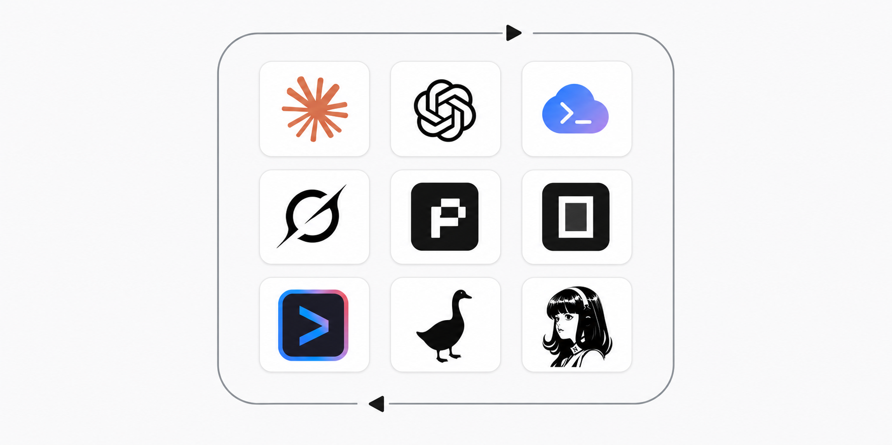

# Harness Sync

Keep skills, instruction files, and MCP server definitions consistent across AI
coding harnesses.

Harness Sync is both an agent skill and a Bun CLI. It discovers the harnesses
installed on a machine, reports drift, and prepares explicit synchronization
plans. Nothing is written until the plan has been reviewed and the apply flags
have been supplied.

It does not include a personal MCP catalog, credentials, or assumptions about a
specific home directory.

## What it manages

- Skills stored canonically in `~/.agents/skills`
- Skill source, version, and content provenance
- Shared `AGENTS.md` and `CLAUDE.md` instruction files
- MCP definitions and provenance across supported harnesses
- Marketplace skill discovery without bulk copying plugin contents
- Backups and automatic recovery when an apply fails

Harness Sync compares MCP definitions by behavior, not just by server name. The
comparison includes transport, command, arguments, working directory, URL,
environment keys, headers, and enabled state. Project and global definitions
remain separate.

## Supported harnesses

| Harness | MCP configuration | Project scope |
| --- | --- | --- |
| Codex | TOML, written directly | Yes |
| Claude Code | Native CLI | Yes |
| Pi | JSON, written directly | No, global only |
| Grok | Native CLI | Yes |
| OpenCode | JSON/JSONC, stable and v2 shapes | Yes |
| Gemini | Native CLI | Yes |
| Hermes | YAML, written directly | No, global only |
| Goose | YAML, written directly | No, global only |

OMP is not supported. The test suite runs on Linux. The CLI recognizes common
macOS path problems, but Windows support has not been verified.

## Requirements

- [Bun](https://bun.sh/)
- At least one supported AI harness
- `npx` for installing skills from remote sources

## Installation

Install it as a global agent skill:

```bash
npx skills add timvdhoorn/harness-sync --skill harness-sync -g
```

## Quick start

The recommended way to use Harness Sync is through an agent. Open the AI coding
harness where you installed the skill and invoke it with the harness's skill
picker or command syntax. In harnesses that expose skills as slash commands,
run:

```text
/harness-sync
```

With no additional command, the agent starts with a read-only audit. It explains
the findings, recommends one next action, and asks one question at a time. When a
change is needed, the agent shows the exact files, scope, conflicts, and secret
movement before asking for confirmation. You do not need to construct the CLI
commands yourself.

You can also give the skill a specific job in plain language:

```text
Use harness-sync to initialize provenance for my installed skills and MCP servers.
```

```text
Use harness-sync to compare my Pi and Codex MCP configurations.
```

The agent runs the required dry runs, handles conflict choices with you, applies
only approved changes, and audits the result afterward.

## Direct CLI usage

The CLI is available for scripting, automation, or use without an agent. Clone
the repository first:

```bash
git clone https://github.com/timvdhoorn/harness-sync.git
cd harness-sync
```

Start with a read-only audit:

```bash
bun run scripts/harness-sync.ts audit
```

Preview the provenance records that `init` would create for the skills and MCP
servers already installed:

```bash
bun run scripts/harness-sync.ts init
```

Write those records after reviewing the preview:

```bash
bun run scripts/harness-sync.ts init --apply --confirmed
```

Preview an MCP synchronization from Codex to OpenCode:

```bash
bun run scripts/harness-sync.ts mcp \
  --from codex \
  --target opencode \
  --scope global
```

The preview contains exact source and target files, affected servers, differing
fields, and secret key names. Secret values are omitted. If the plan is correct,
run the same command with the write gate:

```bash
bun run scripts/harness-sync.ts mcp \
  --from codex \
  --target opencode \
  --scope global \
  --apply \
  --confirmed
```

Run another audit after every apply.

## CLI commands

| Command | Purpose |
| --- | --- |
| `audit` | Find broken skill links, copied or drifted skills, instruction-file problems, MCP conflicts, indirect launchers, and portability issues. |
| `init` | Record the current skill and MCP inventory without guessing unknown sources. |
| `instructions` | Make `AGENTS.md` canonical and link `CLAUDE.md` to it. |
| `add` | Install a skill from a repository, URL, local path, `skills.sh` page, or approved `npx skills add` command. |
| `remove` | Remove one named skill from canonical storage and detected harnesses. |
| `update` | Reinstall tracked skills from their recorded sources. |
| `mcp` | Compare MCP definitions and prepare selected synchronization operations. |
| `mcp-remove` | Prepare removal of named MCP servers from exact harnesses and scope. |

Show the built-in summary with:

```bash
bun run scripts/harness-sync.ts --help
```

[SKILL.md](SKILL.md) defines the agent workflow. The detailed file formats,
ownership rules, and recovery behavior are documented in
[references/behavior.md](references/behavior.md).

## Skill workflows

Add a skill from a repository:

```bash
bun run scripts/harness-sync.ts add owner/repository --skill skill-name
```

Preview updates for every skill with a known source:

```bash
bun run scripts/harness-sync.ts update
```

Skills with unknown provenance are reported and skipped. Harness Sync does not
invent an upstream source from a matching name.

Marketplace caches from Claude, Codex, and Grok are discovery sources only. If
a skill belongs to a plugin that also provides hooks, MCP servers, agents, or
other resources, keeping the native plugin is usually the correct choice.

## Instruction files

Preview instruction synchronization for the current project and user home:

```bash
bun run scripts/harness-sync.ts instructions --scope all
```

`AGENTS.md` is the canonical file. `CLAUDE.md` becomes a relative symlink to it.
An existing regular `CLAUDE.md` is treated as a conflict and is preserved until
replacement is explicitly approved.

## MCP sources and conflicts

MCP definitions can be read from a detected harness, an explicit JSON, JSONC,
TOML, or YAML file, or a repository-local `mcp.json` catalog. The catalog is
gitignored and is used only when selected with `--from catalog` or
`--target catalog`.

Use repeated `--target` flags to update more than one harness and `--server` to
limit the plan to a single server:

```bash
bun run scripts/harness-sync.ts mcp \
  --from pi \
  --target codex \
  --target opencode \
  --server filesystem \
  --scope global
```

Remove one or more MCP servers only after reviewing the exact bindings:

```bash
bun run scripts/harness-sync.ts mcp-remove \
  --scope global \
  --target codex \
  --target opencode \
  --server chrome-devtools \
  --server cloudflare-docs
```

The dry run reports every affected path and missing binding. Re-run the same
command with `--apply --confirmed` after approval. A backup is created before
any native config or provenance file changes.

A same-name semantic difference is a conflict. Resolve each conflict explicitly:

```bash
--resolve filesystem=source
--resolve filesystem=target:codex
--resolve filesystem=merge
--resolve filesystem=skip
```

`merge` is accepted only when fields do not collide. An unresolved conflict in
non-interactive mode exits with code 2 and performs no writes.

Harness Sync also recognizes the optional
`agent-mcp-from-pi <server-name>` launcher used by some Codex configurations. It
can compare the effective Pi definition and, with `--direct`, replace a
proven-equal wrapper with that direct definition. Other installations do not
need this adapter.

## Safety

- Dry runs have `apply: false` and an empty `writes` list.
- Writes require both `--apply` and `--confirmed`.
- Removal, overwrite, conflict resolution, and secret movement require separate
  operator approval when the CLI is used through the skill.
- Every affected path is backed up before mutation.
- A failed apply restores the backup automatically.
- Plans and provenance never contain secret values.
- A project MCP file with likely secret literals must already be gitignored.
- Native configuration files are returned to mode `0600` after writes.
- Unrelated servers, fields, and configuration are preserved.

Skill sources and MCP commands are treated as untrusted input. The CLI accepts
known source shapes and argument lists; it does not execute arbitrary shell text
provided as a skill source.

## Local state

| Data | Default location |
| --- | --- |
| Canonical skills | `~/.agents/skills` |
| Skill provenance | `${XDG_STATE_HOME:-~/.local/state}/harness-sync/skills.json` |
| MCP provenance | `${XDG_STATE_HOME:-~/.local/state}/harness-sync/mcps.json` |
| Backups | `${XDG_STATE_HOME:-~/.local/state}/harness-sync/backups/` |
| Optional local MCP catalog | `./mcp.json` |

State directories use mode `0700`; state files and backups use mode `0600`.

## Development

Run the test suite:

```bash
bun test
```

Run the complete local check, including a secret-free audit:

```bash
bun run check
```

## License

[MIT](LICENSE)
